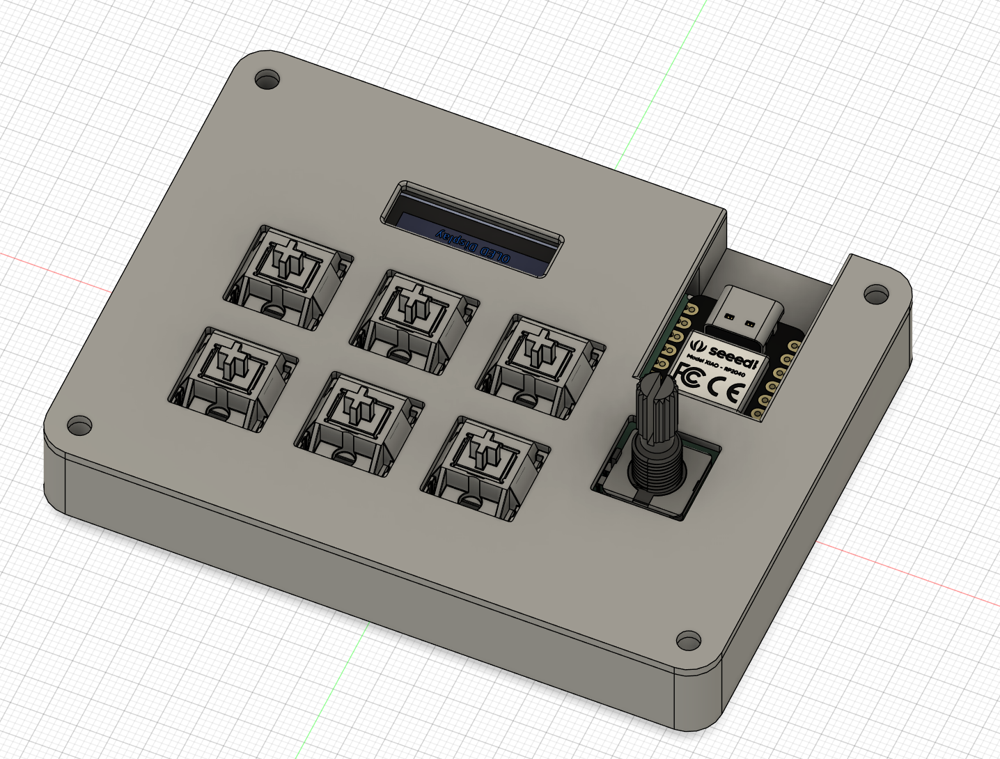
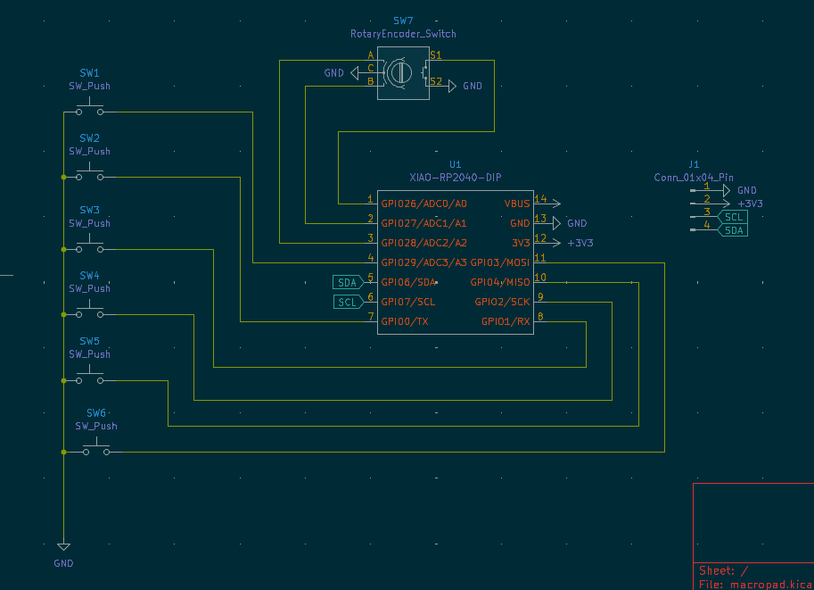
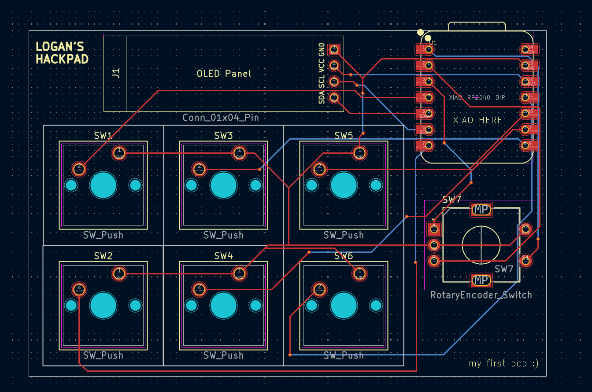

# wheatpad
This is a macropad for personal use. It has six keys, a rotary encoder with a switch, and an OLED screen. I used KMK firmware to code the macropad. I used the macropad as an introduction to PCB design and to increasea my CAD experience. 

## CAD
I used Fusion360 to create my macropad case. There are two parts: a bottom and a top. 

## PCB
Schematic: 

PCB:

## Firmware
I used KMK firmware to code the macropad. Some of the code is placeholder code for now...

## BOM
6x Cherry MX Switches
6x DSA Keycaps
4x M3x5x4 Heatset inserts
4x M3x16mm SHCS Bolts
1x 0.91" 128x32 OLED Display
1x EC11 Rotary Encoder
1x XIAO RP2040
1x Case (2 printed parts)
1x Custom PCB