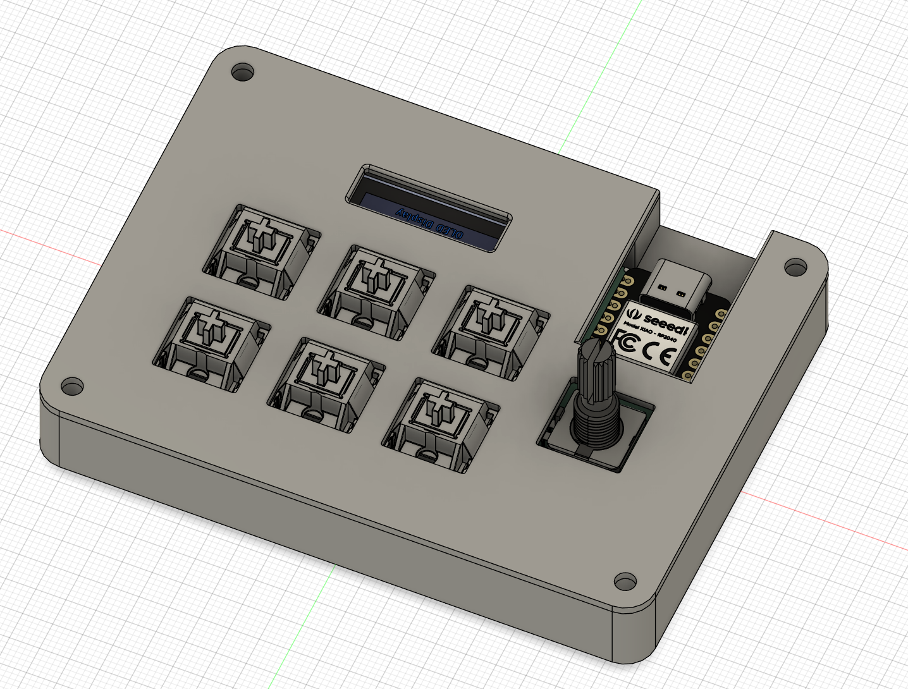
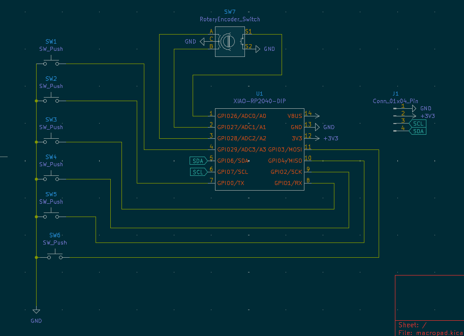
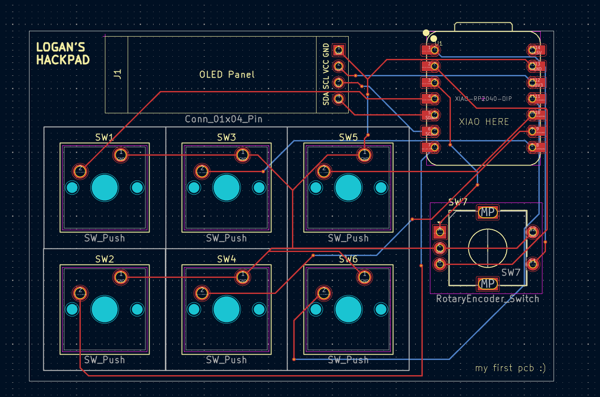

# wheatpad
This is a macropad for personal use. It has six keys, a rotary encoder with a switch, and an OLED screen. I used KMK firmware to code the macropad. I used the macropad as an introduction to PCB design and to increase my CAD experience. 

## Build Photo

## CAD
I used Fusion360 to create my macropad case. There are two parts: a bottom and a top. In the physical model, the PCB will be moved up to allow enough space for keycaps to be pressed. 

## PCB
Schematic: 

PCB:

## Firmware
I updated the firmware for the finished product! 

## BOM
* 6x Cherry MX Switches
* 6x DSA Keycaps
* 4x M3x5x4 Heatset inserts
* 4x M3x16mm SHCS Bolts
* 1x 0.91" 128x32 OLED Display
* 1x EC11 Rotary Encoder
* 1x XIAO RP2040
* 1x Case (2 printed parts)
* 1x Custom PCB
